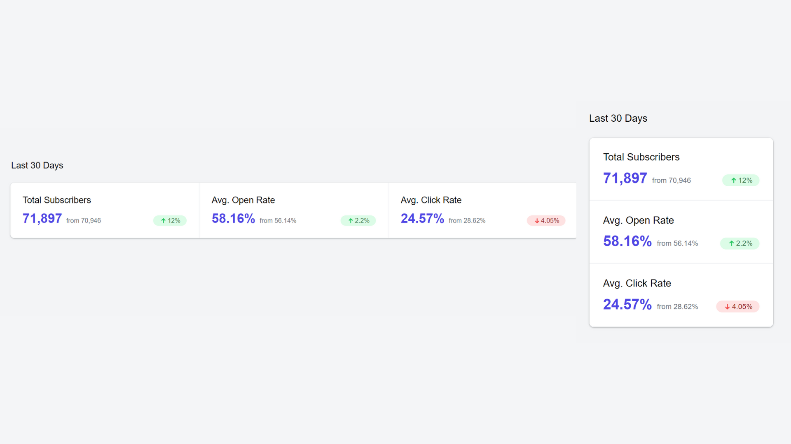

# 30 Days HTML/CSS Challenge

This is a Github repository created for the 30 Days HTML/CSS Challenge offered by the codedamn website. The challenge is designed to help developers improve their HTML/CSS skills by providing daily exercises and projects to work on for a period of 30 days.

Each day of the challenge consists of a new project with instructions and requirements to complete it. This repository contains my solutions to each project and serves as a record of my progress throughout the challenge.

## Progress

| Day | Project Name            | Output                                                        |
| --- | ----------------------- | ------------------------------------------------------------- |
| 1   | Instagram Post          |           |
| 2   | Playground Card         |          |
| 3   | Codedamn Navbar         |          |
| 4   | Login Page              |               |
| 5   | Responsive Pricing Card |  |
| 6   | Stats Card              |                |
| 7   | Profile Header          |            |
| 8   | Blog Section            |              |
| 9   | Tooltip Widget          |         |

Feel free to browse through my code and provide feedback or suggestions for improvement. Thank you for checking out my work!
